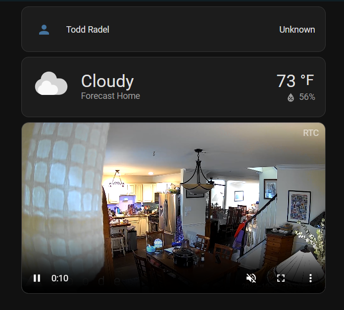
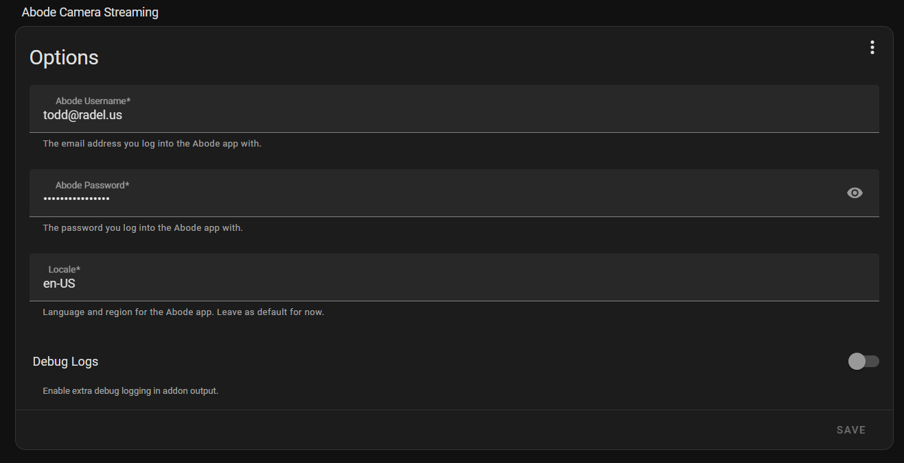

# Home Assistant Add-on: Abode Camera Streaming Support

_Provides streaming video from Abode security cameras._

![Supports aarch64 Architecture][aarch64-shield]
![Supports amd64 Architecture][amd64-shield]
![Does not support armhf Architecture][armhf-shield]
![Supports armv7 Architecture][armv7-shield]
![Supports i386 Architecture][i386-shield]




## Introduction

This is an unofficial addon to [Home Assistant][hass] to support streaming the
Live View from [Abode] cameras. It is based on the excellent work by @AlexxIT and
his [go2rtc] streamer. Many, many thanks to Alex for his hard work!

~~Due to the fact that Abode cuts off the stream when idle, this is currently
more of a proof of concept than anything else. See [below](#limit).~~

As of version 1.2.0, the KVS streams should not time out anymore. Instead of
generating all the URLs as soon as the addon starts, it uses the [echo] feature
of go2rtc to generate the URL right before streaming starts.

**NOTE:** Abode has not published official APIs for their cameras. This addon was
written by observing the Abode web app and reverse-engineering the API calls.
It may stop working if Abode changes their internal APIs.


## Installation

This addon relies on a couple of other custom components: namely [Abode][abode-int]
and WebRTC Camera.

### Prerequisites

 1. If you haven't installed [HACS] yet, do that first. Don't forget to restart
    Home Assistant after you install it.
 2. Add the [Abode component][abode-int]. After it's configured, you should see
    entities for each of your cameras.
 3. Go into HACS and install the "WebRTC Camera" component. Restart Home Assistant.
 4. Go into **Settings** > **Devices & services** and add "WebRTC Camera".
    When prompted for the go2rtc URL, make sure it says `http://localhost:1984/`.

Now you're ready!

### Installing with Supervisor

If you're running HassOS with Supervisor, installing this addon is a piece of cake.
Just click the big blue button:

[](https://my.home-assistant.io/redirect/supervisor_add_addon_repository/?repository_url=https%3A%2F%2Fgithub.com%2Ftradel%2Fhassio-addons)

Or you can add the repository by following these steps:

 1. Navigate to **Settings** > **Add-ons**.
 2. Click the **Add-On Store** button.
 3. In the top right, click the 3-dots menu and select **Repositories**.
 4. Paste in the URL `https://github.com/tradel/hassio-addons` and click **Add**.

Next, refresh your browser (F5 or Ctrl-R), then find the "Abode Camera Streaming"
addon and install it.

### Installing with Docker

Coming soon.

### Manual installation

Coming soon.

## Configuration

Once the addon is installed, click the Configuration tab. The only required fields
are your Abode username (usually an email address) and password. Don't forget to click Save.



## Adding the stream to a Lovelace dashboard

Edit your dashboard or create a new one. Click the **Add Card** button and select
the "Custom: WebRTC Camera" card type. As of this writing, WebRTC Camera does not
support visual editing, so HA will open a YAML editor. Copy and paste the following
code into the editor:

```yaml
type: custom:webrtc-camera
streams:
  - type: webrtc
    url: kitchen_cam
```

Replace `kitchen_cam` with the entity name of your camera.

The WebRTC Camera component has lots of other options. Consult [the documentation][webrtc]
to see what's supported.

## How it works

Unlike most home automation cameras, the Abode cams don't seem to support any kind of
local streaming. Network probes don't show any open ports at all.

Instead, the cameras send video to [Amazon Kinesis Video Streams][kvs], which handles
features like motion detection and transcoding. When you start Live View, the
[Abode app][webapp] makes a POST to `/integrations/v1/camera/.../kvs/stream`, which
sets up a KVS stream and returns the endpoint URL and other data to the app:

```json
{
    "channelEndpoint": "wss://v-50e9eb79.kinesisvideo.us-west-2.amazonaws.com/...",
    "iceServers": [
        {
            "urls": [
                "stun:stun.kinesisvideo.us-west-2.amazonaws.com:443"
            ]
        },
        {
            "credential": "...",
            "username": "...",
            "urls": [
                "turn:35-91-177-138.t-853e5b95.kinesisvideo.us-west-2.amazonaws.com:443?transport=udp",
                "turns:35-91-177-138.t-853e5b95.kinesisvideo.us-west-2.amazonaws.com:443?transport=udp",
                "turns:35-91-177-138.t-853e5b95.kinesisvideo.us-west-2.amazonaws.com:443?transport=tcp"
            ]
        },
        {
            "credential": "...",
            "username": "...",
            "urls": [
                "turn:54-200-107-138.t-853e5b95.kinesisvideo.us-west-2.amazonaws.com:443?transport=udp",
                "turns:54-200-107-138.t-853e5b95.kinesisvideo.us-west-2.amazonaws.com:443?transport=udp",
                "turns:54-200-107-138.t-853e5b95.kinesisvideo.us-west-2.amazonaws.com:443?transport=tcp"
            ]
        }
    ],
    "type": "KVS"
}
```

At first I tried to build some kind of Frankenstein KVS proxy, but it turns out that
[go2rtc] already knows how to handle KVS streams, so after tearing out what little
hair I had left, the solution turned out to be surprisingly easy. I just get the
Abode camera IDs from Home Assistant, call the Abode API for each, use those URLs
to create a `go2rtc.yaml` configuration file, and then launch `go2rtc`.

The end result looks like this:

```yaml
webrtc:
  candidates:
    - stun:8555

hass:
  config: '/config'

log:
  level: 'info'

streams:
  kitchen_cam: 'webrtc:wss://v-50e9eb79.kinesisvideo.us-west-2.amazonaws.com/...#format=kinesis#client_id=1658369854733#ice_servers=[{"urls": [...]}]'
```


## Limitations

- <a name="limit"></a>
  ~~Streams only work for a few minutes before the URL becomes invalid. This doesn't
  happen if the stream is actively playing. I suspect that Abode is shutting down
  inactive KVS streams to save resources. I am working on potential solutions for this.~~
  *(fixed in 1.2.0)*

- ~~If go2rtc or other streaming addons are installed, there may be port conflicts
  and abode2rtc will fail to start. This will be fixed in a future release.~~
  *(fixed in 1.2.0)*

- The addon includes an AppArmor profile for security, but the profile still needs
  some tweaking, so it's currently in "complain" mode. Once I have time to tweak it,
  I'll turn on enforcing mode.

## Frequently Asked Questions (FAQ)

**I see the error "streams: websocket: bad handshake".**

Try upgrading to version 1.2.0 or later of the addon. If you still see this, please
[open a Github issue][bug] and include the complete log.

**Why isn't the armhf platform supported?**

This addon relies on [go2rtc], which doesn't support armhf.

**I have another problem.**

Feel free to [create a Github issue][bug] and I'll take a look. Please include the
full log from the addon, if possible.


[aarch64-shield]: https://img.shields.io/badge/aarch64-yes-green.svg
[amd64-shield]: https://img.shields.io/badge/amd64-yes-green.svg
[armhf-shield]: https://img.shields.io/badge/armhf-no-red.svg
[armv7-shield]: https://img.shields.io/badge/armv7-yes-green.svg
[i386-shield]: https://img.shields.io/badge/i386-yes-green.svg
[abode]: https://goabode.com/
[hass]: https://www.home-assistant.io/
[hacs]: https://hacs.xyz/
[abode-int]: https://www.home-assistant.io/integrations/abode/
[go2rtc]: https://github.com/AlexxIT/go2rtc
[webrtc]: https://github.com/AlexxIT/WebRTC/blob/master/README.md#custom-card
[kvs]: https://aws.amazon.com/kinesis/video-streams/
[webapp]: https://my.goabode.com/#/app/live-video
[bug]: https://github.com/tradel/hassio-addons/issues/new/choose
[echo]: https://github.com/AlexxIT/go2rtc/wiki/Source-Echo-examples
